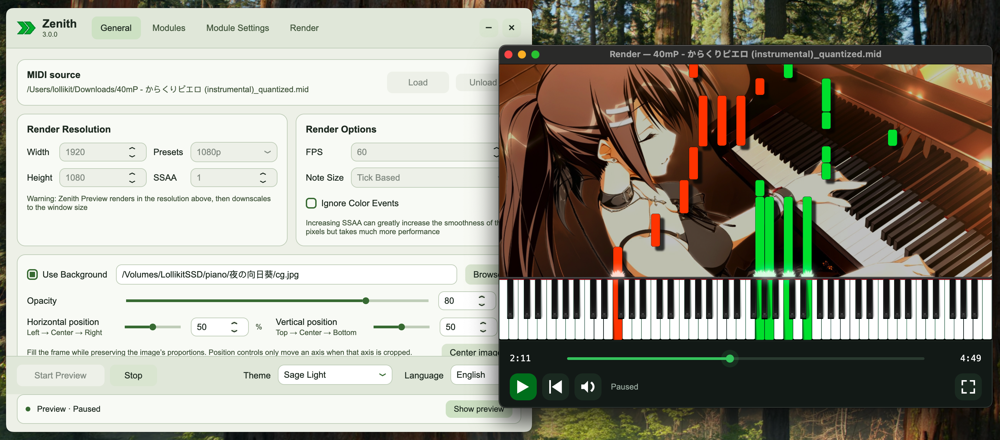
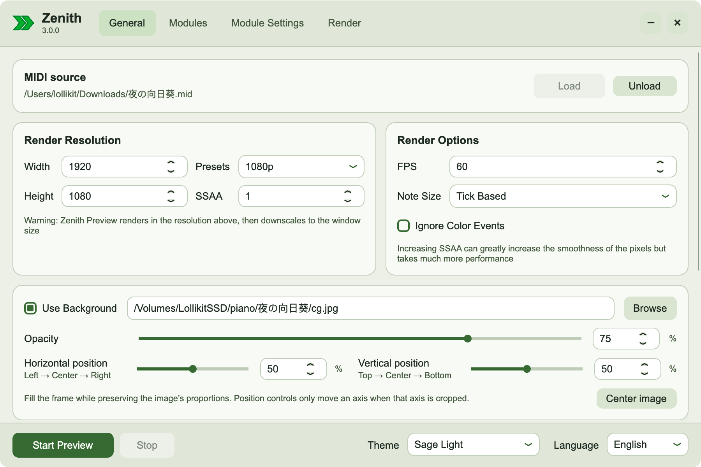

<div align="center">
  
  <h1>Zenith for macOS</h1>
  <p><strong>A modern MIDI renderer rebuilt for Mac</strong></p>
  <p>基于原版 Zenith 的 MIDI 解析、渲染算法与 Scripted 皮肤格式，面向 macOS 的全新 3.0.0 应用。</p>

  <h2>Demo</h2>
  <p><a href="docs/images/demo-render-preview.png"></a></p>
  <p><em>Main interface, background opacity controls and the seekable MIDI preview.</em></p>
  <p><a href="docs/images/demo-palette-editor.png"></a></p>
  <p><em>Palette editing with the preview updating alongside channel colors.</em></p>

  <a href="https://github.com/natsunoshion/Zenith-Mac/releases"></a>
  <a href="https://github.com/natsunoshion/Zenith-Mac/releases"></a>
  <a href="LICENSE"></a>
  <a href="https://github.com/natsunoshion/Zenith-Mac/pulls"></a>

  <p>
    <a href="#download">⬇️ Download</a> ·
    <a href="#features">✨ Features</a> ·
    <a href="#quick-start">🎹 Quick start</a> ·
    <a href="#demo">🖼 Demo</a> ·
    <a href="#macos-rebuild">🍎 macOS rebuild</a> ·
    <a href="#license">📄 License</a>
  </p>
</div>

## Highlights

These are the macOS edition's showcase features, built on top of the original Zenith renderer:

- **Seekable preview:** drag the timeline to jump to any point in playback.
- **Editable palettes:** customize MIDI channel colors, including left-to-right two-color gradients, and preview edits live.
- **Background transparency:** adjust the image opacity so the notes stay clear against the artwork.
- **Automatic drop shadow:** append a configurable shadow pass to rendered notes, with controls for blur, direction, distance and opacity.
- **Selectable themes:** choose from Sage Light, Nord Snow Storm, Nord Polar Night, Catppuccin Latte, Catppuccin Mocha and Solarized Light.

## Features

- **Live preview:** play through a MIDI while changing render and module settings; preview updates without restarting playback.
- **Multiple render modules:** Classic, Flat, PFA+, MIDITrail+, Note Counter, Textured and Scripted.
- **Scripted resource packs:** load `.zrp` skins with textures, particles, profiles and generated settings.
- **Video export:** render H.264 video with optional audio and transparency mask; choose software encoding or Apple hardware H.264.
- **Composition controls:** crop-to-fill backgrounds, opacity and position controls, plus a configurable drop-shadow pass automatically applied to rendered notes.
- **Palette editor:** create and edit channel colors, gradients and alpha values, with live preview.
- **macOS interface:** four focused pages, six selectable interface themes and a dedicated seekable playback window.

## Render modules

Zenith includes the original renderer families and the Scripted runtime:

- **Classic** — the original Zenith rendering style.
- **Flat** — a clean, unshaded note style.
- **PFA+** — a Piano From Above inspired renderer with gradients and transparency.
- **MIDITrail+** — trails, auras and 3D note boxes.
- **Note Counter** — configurable MIDI statistics and labels.
- **Textured** — custom note caps, keyboard artwork and textures.
- **Scripted** — C# skins with textures, fonts, particles, profiles and dynamic controls.

Scripted skins are loaded from the **Module Settings → Resources** page. The bundled **Synthesia X** pack is selected automatically when Scripted is opened for the first time. Additional compatible packs can be selected from the resource list.

## Download

Download the latest macOS release from the [Releases page](https://github.com/natsunoshion/Zenith-Mac/releases/latest). The app bundle includes the .NET runtime; users do not need to install the .NET SDK.

- **Platform:** Apple Silicon (arm64)
- **Minimum macOS:** 12.0
- **Video export:** requires a macOS build of [FFmpeg](https://ffmpeg.org/download.html), which is not bundled.

The current build is for development and testing. A public build should be signed and notarized before general distribution.

## Quick start

1. **🎼 Load a MIDI** — open **General → Load MIDI** and choose a `.mid` file.
2. **🧩 Choose a renderer** — open **Modules** and select **Scripted** or another module.
3. **🎨 Pick a skin and palette** — in **Module Settings → Resources**, select **Synthesia X** or another resource pack. Use the palette list to choose colors; **New** and **Edit** open the palette editor.
4. **▶️ Preview** — click **Start Preview**. The separate player window supports seek, play/pause, restart, mute and fullscreen. Settings can be changed while preview is running.
5. **🎬 Render** — choose an output path and encoding options on **Render**, then click **Start Render**. Audio and transparency-mask output are optional.

For keyboard shortcuts and playback details, see [Playback controls](docs/PLAYBACK.md). Background and shadow controls are described in [Background effects](docs/BACKGROUND_EFFECTS.md).

## macOS rebuild

This is a source port and continuation of [arduano/Zenith-MIDI](https://github.com/arduano/Zenith-MIDI), rebuilt around Avalonia and macOS system frameworks while retaining the original renderer code and Scripted pack behavior.

- OpenGL rendering uses macOS CGL with OpenGL 4.1.
- MIDI playback uses Apple's AudioUnit DLS synthesizer.
- The UI keeps the original workflow—General, Modules, Module Settings and Render—while using a macOS-oriented layout and selectable themes.
- Backgrounds preserve aspect ratio, fill the output and crop the overflow. Preview changes update without resetting playback.
- Custom palettes are stored per user at `~/Library/Application Support/Zenith-Mac/Palettes`.
- The app bundle is self-contained for .NET. FFmpeg remains an external dependency for video encoding.

The source follows the upstream renderer and plugin architecture, but platform APIs differ. See [parity notes](docs/PARITY.md) for tested behavior and known differences.

## Build from source

Requirements: macOS, .NET 9 SDK, `7z` and Python 3. Video export checks also require macOS FFmpeg.

```sh
git clone --recurse-submodules https://github.com/natsunoshion/Zenith-Mac.git
cd Zenith-Mac
```

Place the original `Zenith.7z` resource archive in the repository root, then prepare assets and run the app:

```sh
./tools/prepare-assets.sh
dotnet build Zenith.Mac.sln
dotnet run --project src/Zenith.Mac
```

To create the Apple Silicon application bundle:

```sh
./tools/build-app.sh
```

The app is written to `dist/Zenith.app`. An Intel target is available as `./tools/build-app.sh osx-x64`, but has not been validated on Intel hardware.

## Resource pack compatibility

Zenith for macOS is intended to support the same resource packs as the original Zenith. Compatibility across the full pack catalog has not yet been verified. Packs that rely on Windows-only binaries or APIs may need a macOS-compatible build.

## License

The original Zenith source is distributed under the [Don't Be a Dick Public License](upstream/LICENSE). Original authorship and third-party components are listed in [THIRD_PARTY_NOTICES.md](THIRD_PARTY_NOTICES.md). The upstream project is maintained at [arduano/Zenith-MIDI](https://github.com/arduano/Zenith-MIDI).

---

**3.0.0 macOS rebuild** · See the [documentation](docs/) for feature guides, technical notes and validation details.
